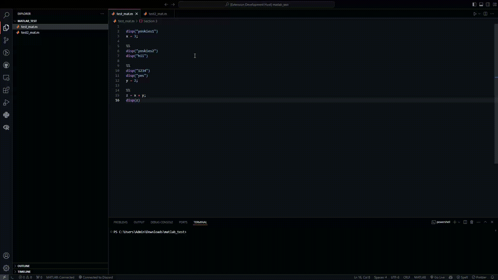

# MATLAB Extra Support

This Visual Studio code extension provides additional features to the MATLAB extension by *MathWorks*. Users can run individual sections of code in a MATLAB file directly inside VS Code.



## Usage and Features

To run a particular section of code, have your cursor within that section and then run the `Run Current Section` command through command palette or by pressing **ctrl + enter**. Note that "sections" in MATLAB files are lines of code separated by `%%`. For example the following code has two sections.

```matlab
%%
x = 1;
disp(x);

%%
y = x + 2;
disp(y);
```
You can also run the current section of code and all code above it by pressing **ctrl + shift + enter** or using the `Run Current Section and all Above` command through command palette.

Supports Windows, Mac, and Linux.

## Requirements

This extension requires you to have the VS Code extension *MATLAB* by *MathWorks* installed.


## Known Issues

Currently there is an issue with the workspace variables persisting across different MATLAB terminal sessions. This is because of how the MATLAB extension by *MathWorks* works. I am working on a solution to reset the workspace each time but I am not yet sure how to since the MATLAB shell does not work like a normal terminal. 

Feel free to open an issue if you find any problems, or even a PR if you have any solutions.

## Release Notes

Users appreciate release notes as you update your extension.

### 1.0.0

Initial release.

